# ReccostApp
This is my second Swift iOS app
***
Description
>In this application you can find books to your liking and add them to the cart. But adding to the cart is only possible if you have registered. The application works through a remote FireBase database.

>Supported darck and light mode
***
Software stack of knowledge
>Swift, UIKit, FireBase DataBase, FireBase Auth, FireBase Storage, NSLayoutConstraint, UIView.animate etc.
***
Screenshots

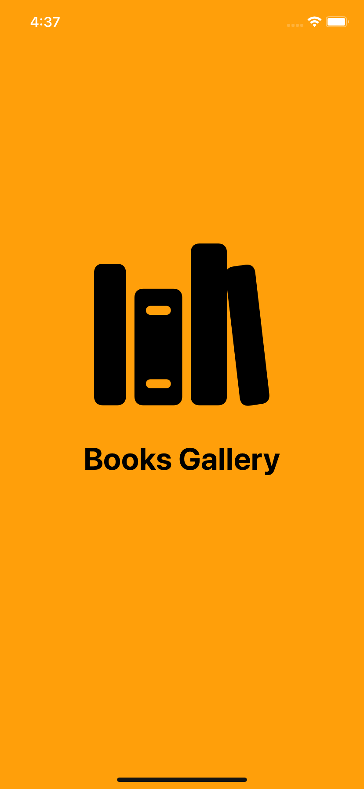
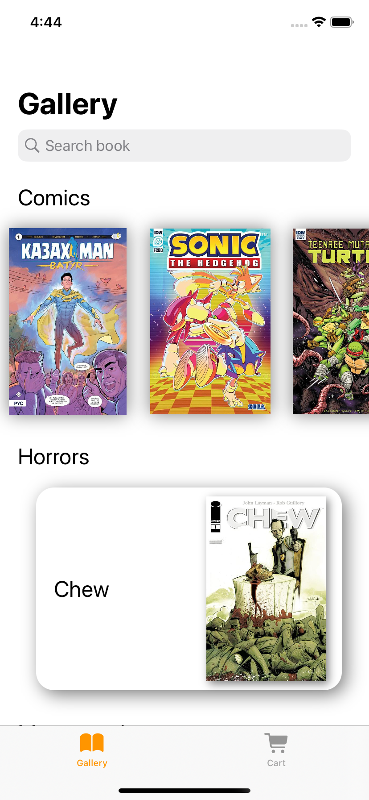
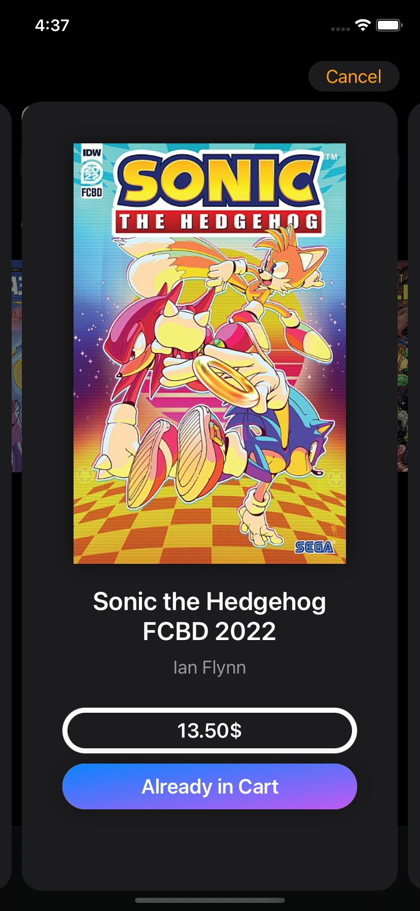
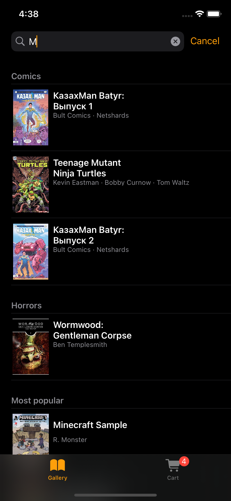
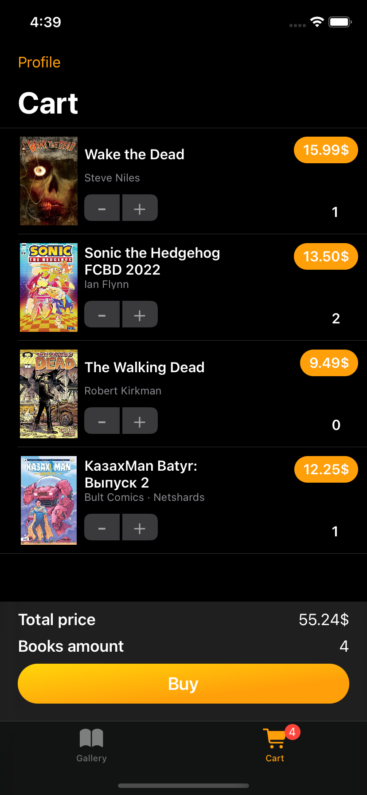
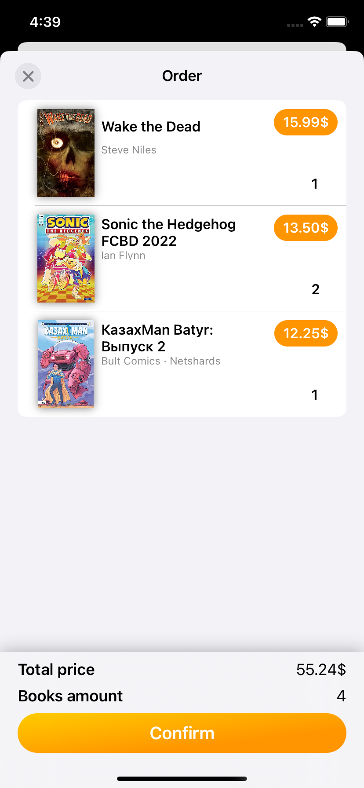
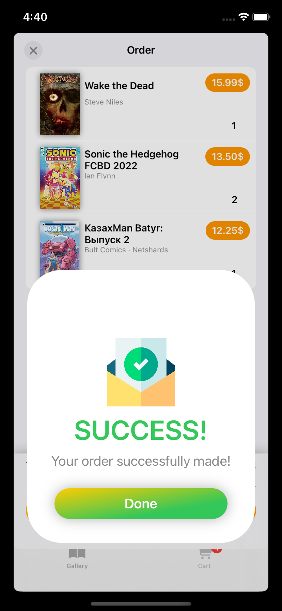
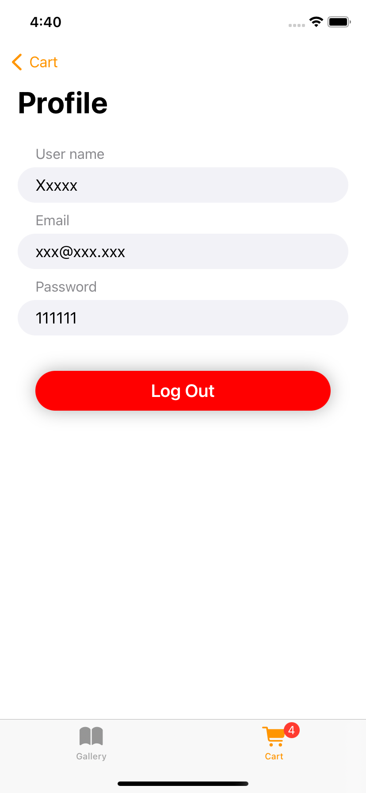
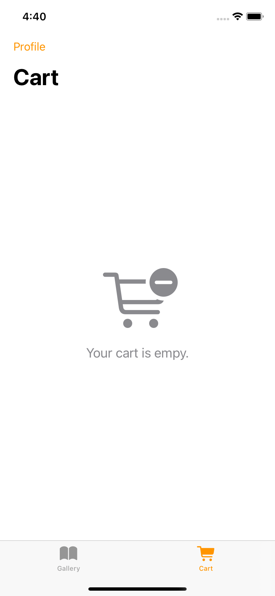
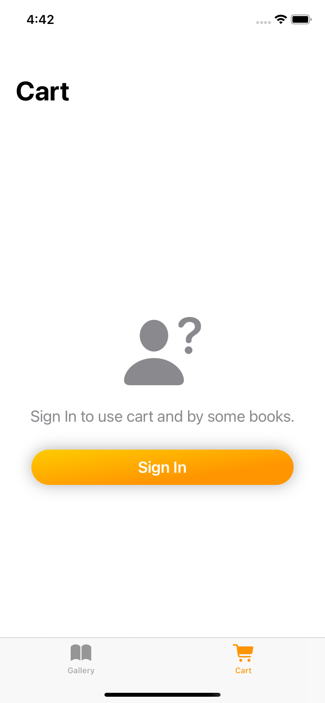
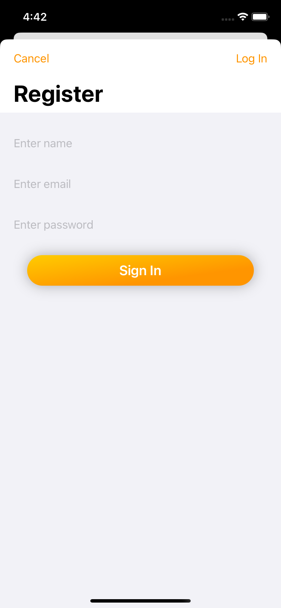

***
